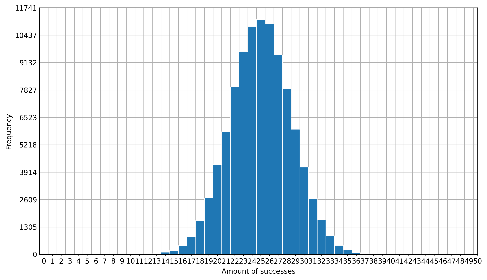

# Discrete Binomial Distribution Visualiser

## Overview

A Jupyter Notebook visualiser for disrete binomial distributions

## Output

The notebook outputs two graphs, the former being the probability histogram of the binomial distribution and the latter being the comparison of the experimental probablities and the theoretical ones calculated with the binomial distribution formula:
 

### Experimental probability histogram output example

### Experimental vs theoretical probability graph exmaple

## Parameters

In order to generate the binomial data, 4 parameters are required:

 + `trials` - the amount of times to do the entire experiment (the greater the number of trials, the greated the resemblence to the theoretical probablitites)
 + `iterations` - the amount of a single random action makes up one experiment (for example, the experiment tossing a coin 10 times would have 10 for the `iterations` parameter)
 + `success_number` - the amount of successful outcomes (for tossing a coin this would be 1)
 + `total_number` - the total amount of outcomes (for tossing a coin this would be 2)

*Note: the probablity is calculated by `success_number / total_number`*

## Acknoledgements
Created by Nasser Kessas

## Contributing
PRs accepted, feel free to dive in! [Open an issue](https://github.com/nasserkessas/discrete-binomial-distribution-visualiser/issues/new) or submit PRs.

Discrete Binomial Distribution Visualiser follows the [Contributor Covenant](http://contributor-covenant.org/version/1/3/0/) Code of Conduct.